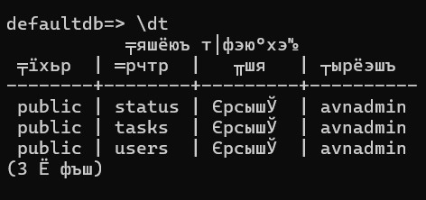
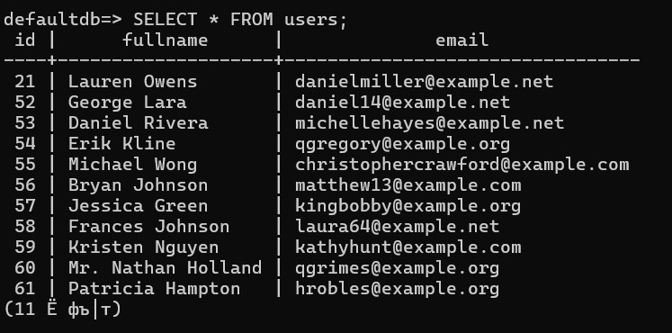
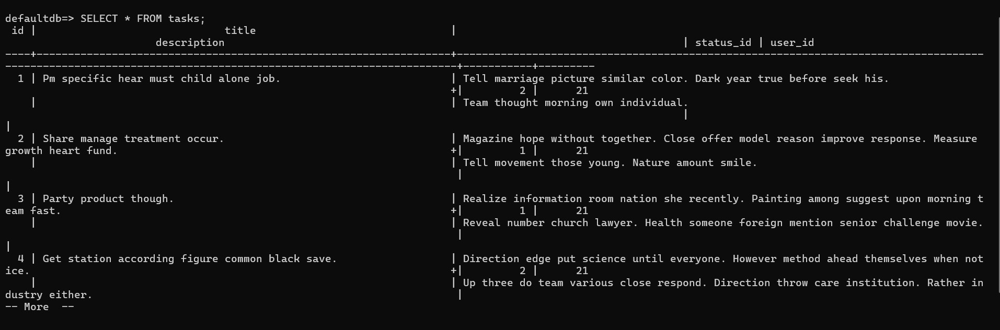
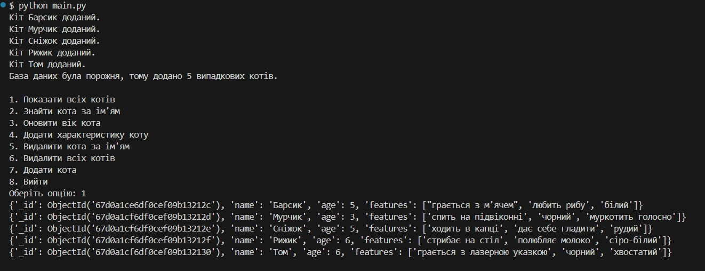
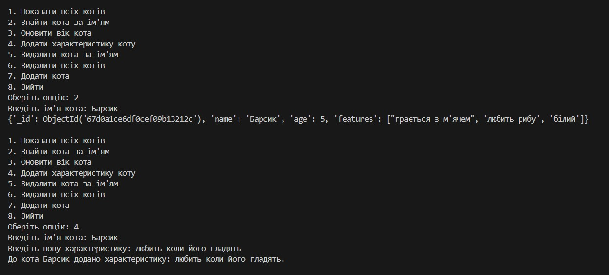
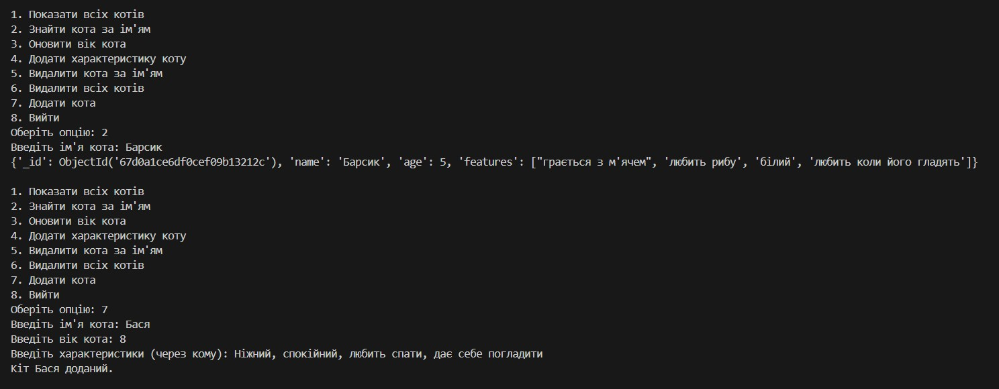
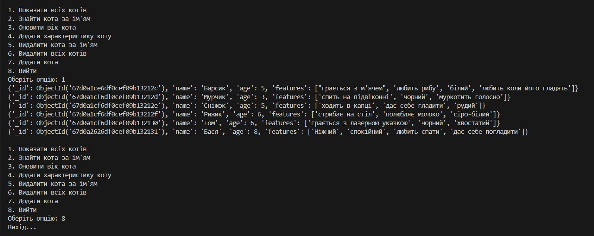

# goit-cs-hw-03

Task_1

pip install psycopg2-binary==2.9.5

python create_db.py

Створення таблиці в БД

python seed.py

Читання данних з БД після запитів

Task_2

pip install pymongo

python main.py

Виконання скрипта

